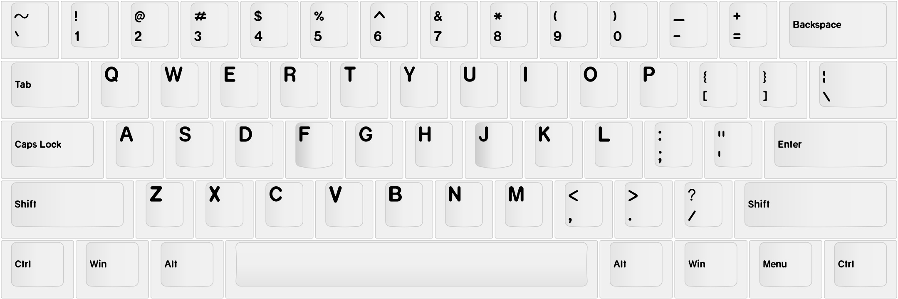

# `pykeyset`

A Python-based tool to create pretty keyset layout diagrams using correct fonts and icons.

## Warning

<b>This project is currently in the early stages of development.
It currently supports exactly what I need for TA Origins, and not much else.
You may run into various bugs and crashes as there are currently no unit tests at all 😄.
In future I hope to stabilise this project and add more extensive support for different
profiles, fonts, file formats, etc.</b>

If you want to help improve this project please feel free to contribute
by opening bug reports, feature requests, etc; or contributing to the code directly with a pull request.

## Example usage

`pykeyset` uses commands to tell it what to do.
Commands can be given on the command line,
but the easiest way is to create a *`.cmdlist`* (command list) file.
Each line of the command list is a command for pykeyset to execute.

For example, a file called *`example.cmdlist`* contains the following commands:

    load kle http://www.keyboard-layout-editor.com/#/gists/102f1fb614275f50e39d970d691e1030
    load profile cherry
    load font cherry
    generate layout
    save svg example.svg

To execute the command list run:

    pykeyset example.cmdlist

The output in *`example.svg`* is:

## Python API

Currently you *can* use `pykeyset` directly as a Python module,
but as it is still in early development the API will probably change a lot.
In future there will hopefully be a more stable API, so you don't need to mess around with *.cmdlist* files.

## Building

To install this package locally, run:

    pip install <path to this package>

To build this package, the easiest way is to use [`build`].
To install `build` and build `pykeyset`, run:

    pip install build
    python3 -m build --sdist --wheel

## Contributing

`pykeyset` uses [`black`] for formatting, and all code must pass [`flake8`]'s checks.
These are checked by GitHub on all pull requests.
To run these tools automatically when committing,
install the [`pre-commit`] hook in [`.pre-commit-config.yaml`].

## Credits

The builtin *`cherry`* font is based on [Open Cherry] by Dakota Felder

[`build`]: https://pypa-build.readthedocs.io/en/latest/installation.html
[open cherry]: https://github.com/dakotafelder/open-cherry
[`black`]: https://github.com/psf/black
[`flake8`]: https://flake8.pycqa.org/en/latest/
[`pre-commit`]: https://pre-commit.com/
[`.pre-commit-config.yaml`]: .pre-commit-config.yaml
