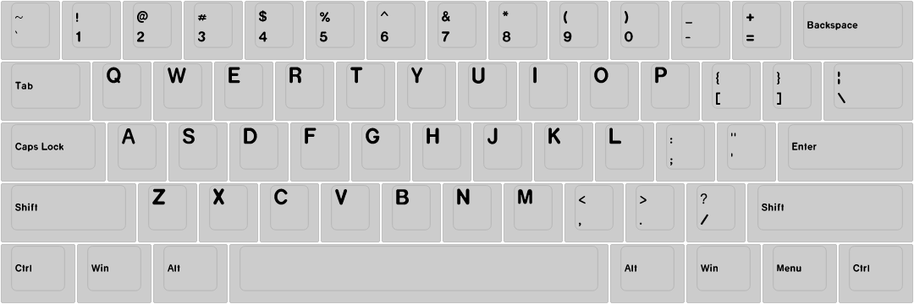

# [`pykeyset`][pykeyset]

A Python-based tool to create pretty keyset layout diagrams using correct fonts and icons.

[][actions]
[][actions]
[][coverage]
[][pypi]
[][black]
[][pypi]
[][pypi]
[][licence]

## Warning

**This project is currently in the early stages of development.
It currently supports exactly what I need for TA Origins, and not much else.
At the moment it has only just over 75% test coverage, but this is continuously increasing.
If you do find any bug or experience any crashes, please report them on the [GitHub repo][pykeyset].
In future I hope to stabilise this project, add more extensive support for different profiles, fonts, file formats, etc; and have a more extensive API.**

Feel free to help this project improve by opening bug reports, feature requests, etc; or contributing directly to the code by opening a pull request.

## Example usage

`pykeyset` uses commands to tell it what to do.
The easiest way is to use it is to create a *.cmdlist* (command list) file.
Each line of the command list is a command for pykeyset to execute.

For example, a file called *example.cmdlist* contains the following commands:

    load kle http://www.keyboard-layout-editor.com/#/gists/102f1fb614275f50e39d970d691e1030
    load profile cherry
    load font cherry
    generate layout
    save svg example.svg

To execute the command list run:

    pykeyset run example.cmdlist

The output in *example.svg* is:

## Python API

Currently you *can* use `pykeyset` directly as a Python module, but as it is still in early development the API will probably change *a lot* until a 0.1 release.
After that there will be a relatively stable API, so you don't need to mess around with *.cmdlist* files if you're familiar with Python.

## Installation

`pykeyset` is available on [PyPI]. To install with `pip` run:

    pip install pykeyset

Or to install the latest source directly from GitHub, run:

    git clone https://github.com/staticintlucas/pykeyset.git pykeyset
    cd pykeyset
    pip install .

This project uses [Poetry] as it's dependency manager and build system.
To install this package locally for development, run:

    poetry install

To build the source distribution and wheel run:

    poetry build

## Contributing

`pykeyset` uses [Black] and [isort] for formatting, and all code must pass [Flake8]'s checks.
These are checked by GitHub on all pull requests.
To run these tools automatically when committing, install the [pre-commit] hook in [`.pre-commit-config.yaml`].

## Credits

The builtin `cherry` font is based on [Open Cherry] by Dakota Felder.

[pykeyset]: https://github.com/staticintlucas/pykeyset
[actions]: https://github.com/staticintlucas/pykeyset/actions
[coverage]: https://codecov.io/gh/staticintlucas/pykeyset
[licence]: LICENCE
[pypi]: https://pypi.org/project/pykeyset/
[black]: https://github.com/psf/black
[isort]: https://pycqa.github.io/isort/
[Poetry]: https://python-poetry.org/
[open cherry]: https://github.com/dakotafelder/open-cherry
[flake8]: https://flake8.pycqa.org/en/latest/
[pre-commit]: https://pre-commit.com/
[`.pre-commit-config.yaml`]: .pre-commit-config.yaml
